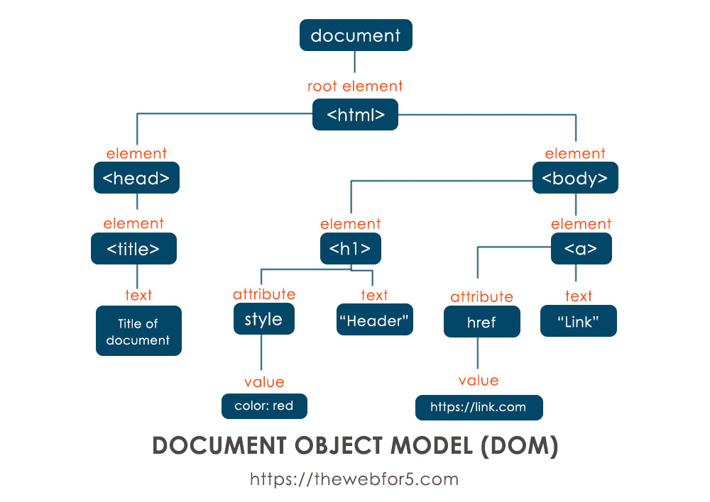

# Running The Website
1. Install visual studio code.
2. Go to the extensions tab and install this extension ["Live Server"](https://marketplace.visualstudio.com/items?itemName=ritwickdey.LiveServer).
3. Navigate to the index.html file and click on "Go Live" on the bottom right of the editor.

# JavaScript

## Document Object Model (DOM)
When an HTML document is loaded into a web browser, it becomes a document object.
The document object is the root node of the HTML document.
The document object is a property of the window object.
The document object is accessed with: `window.document` or just `document`.



## Fetching

### Try Catch
The try...catch statement is comprised of a try block and either a catch block, a finally block, or both. The code in the try block is executed first, and if it throws an exception, the code in the catch block will be executed.
```js
try {
  nonExistentFunction();
} catch (error) {
  console.error(error);
  // Expected output: ReferenceError: nonExistentFunction is not defined
  // (Note: the exact output may be browser-dependent)
}
```

---

### Async Await

#### What is a Promise?
The Promise object represents the eventual completion (or failure) of an asynchronous operation and its resulting value.

A Promise is in one of these states:
  - pending: initial state, neither fulfilled nor rejected.
  - fulfilled: meaning that the operation was completed successfully.
  - rejected: meaning that the operation failed.


#### Let's come back to the async await.

**`async`** and **`await`** are used in JavaScript to handle asynchronous code in a way that looks more like synchronous code, making it easier to read and write.

1. **`async`**:
    - Declares a function as asynchronous.
    - Automatically wraps the return value in a Promise.

   ```javascript
   async function myFunction() {
     return "Hello!";
   }
   myFunction().then(console.log); // Outputs: Hello!
   ```

2. **`await`**:
    - Pauses the execution of an `async` function until a Promise resolves.
    - Allows you to work with the resolved value directly.

   ```javascript
   async function fetchData() {
     const response = await fetch("https://api.example.com/data");
     const data = await response.json();
     console.log(data);
   }
   ```

### **Key Points**:
- **Must Use Together**: `await` can only be used inside an `async` function.
- **Non-blocking**: Other code can still run while waiting for the `await` to resolve.

Example:
```javascript
async function example() {
  console.log("Start");
  const result = await new Promise((resolve) => setTimeout(() => resolve("Done!"), 1000));
  console.log(result); // Outputs after 1 second: Done!
  console.log("End");
}
example();
```

---

### Fetch()
The Fetch API interface allows web browser to make HTTP requests to web servers.
With the Fetch API, you make a request by calling `fetch()`, which is available as a global function in both window and worker contexts.
You pass it a Request object or a string containing the URL to fetch, along with an optional argument to configure the request.

```js
async function getData() {
  const url = "https://example.org/products.json";
  try {
    const response = await fetch(url);
    if (!response.ok) {
      throw new Error(`Response status: ${response.status}`);
    }

    const json = await response.json();
    console.log(json);
  } catch (error) {
    console.error(error.message);
  }
}
```

## History
The History API provides access to the browser's session history through the history global object. It exposes useful methods and properties that let you navigate back and forth through the user's history, and manipulate the contents of the history stack.

| Method      | Description                                |
| ----------- | ------------------------------------------ |
| `back()`    | Loads the previous URL in the history list |
| `forward()` | Loads the next URL in the history list     |
| `go()`      | Loads a specific URL from the history list |
